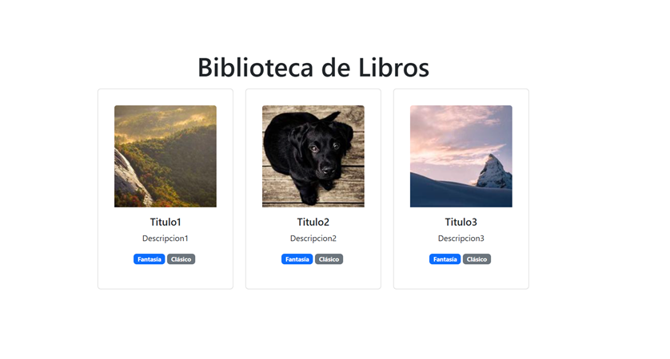

#Módulo 4 REACT I Biblioteca React + Vite

## Presentación de Página Web

 

---

 

## Descripción del PY ⌨️

En este proyevto validaremos nuestros conocimientos de la unidad Introducción a REACT. Aplicaremos los conocimientos en la creación de componentes y de este modo ejercitar y adquirir velocidad al momento de desarrollar aplicaciones en React. La aplicación funciona como Biblioteca.

## Tecnologías Usadas 🛠️

- **HTML** 💀
- **CSS** 🌈
- **JS** 🧑‍💻
- **REACT** 👌

 

---

 

## Autor 👨‍💻

**Desarrolladores FullStack G-60⚡**

Sígueme en mis redes sociales: 
 
